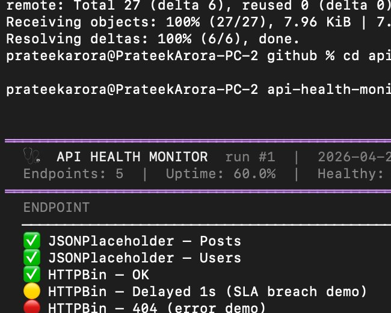

# 🩺 API Health Monitor

[](https://python.org)
[](.)

A production-grade Python CLI that polls REST API endpoints in parallel, measures response time vs SLA thresholds, and exports structured reports.

> Built from **5 years of production experience** managing 40+ courier API integrations at Shiprocket.



## Quick Start
```bash
git clone https://github.com/Prateek-Aroraa/api-health-monitor.git
cd api-health-monitor
python main.py
python main.py --config config/endpoints.json
python main.py --watch --interval 30
python main.py --json-out report.json
```

## Features
- HEALTHY / DEGRADED / ERROR / DOWN per endpoint
- Per-endpoint SLA threshold enforcement
- Parallel probing with ThreadPoolExecutor
- JSON + CSV export
- Watch mode for continuous monitoring
- Zero external dependencies

## Project Structure
```
api-health-monitor/
├── main.py
├── checker.py
├── dashboard.py
├── config_loader.py
├── config/endpoints.json
├── config/endpoints.yaml
├── tests/test_checker.py
└── README.md
```

**Author:** Prateek Arora — Production Engineer · 5 years at Shiprocket
[github.com/Prateek-Aroraa](https://github.com/Prateek-Aroraa)